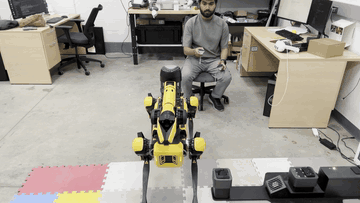
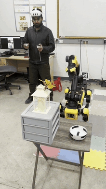
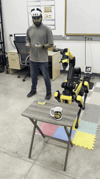
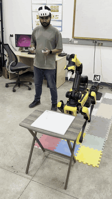

# spot_teleop
**Boston Dynamics Spot SDK 5.0 | Meta Quest 3 / SpaceMouse / Keyboard**

A Python package for teleoperating Boston Dynamics Spot+Arm using Meta Quest 3, SpaceMouse, or keyboard, and recording demonstrations for visomotor policy training (Diffusion, Flow-matching, pi0.5, etc.). Integrates a real-time Cartesian force-limiting compliance filter to protect the robot arm and environment during contact-rich tasks.
<p align="center">
  
</p>

---

## Demonstration Showcase

These human teleoperation demonstrations showcase diverse manipulation and mobility tasks successfully recorded using this framework:

| Push, Pick & Place | Sweep Clean | Writing "A" |
| :---: | :---: | :---: |
|  |  |  |

---

## Key Features
| Capability | Details |
|------------|---------|
| **Multi-input teleoperation** | Meta Quest 3 hand tracking, 3Dconnexion SpaceMouse, or keyboard -- choose via `--teleop-type`. |
| **Full-body control** | Drive base with joystick/keys, servo arm & gripper with 6-DoF input at 30 Hz. |
| **Anchor-and-delta control** | Hold grip to anchor pose; move hand and end-effector follows. |
| **Demo recording** | Record RGB+depth images, joint states, EE poses, body velocity into `.npz` / `.h5` for policy training. |
| **Safe start-up / shutdown** | Auto-acquires lease, clears Keepalive & Estop, undocks, stands, and power-offs cleanly. |
| **No ROS, no Unity** | Pure Python on top of official `bosdyn-client==5.0.0`. |
| **Quest 3 tracking pipeline** | Uses [`OculusReader`](https://github.com/rail-berkeley/oculus_reader) for sub-10 ms pose streaming. |
| **Active Force Limiting** | Cartesian force protection dynamically blocks or scales commands pushing into obstacles to protect the arm and environment. |

---

## Controller Key Map

ToDo

---

## Prerequisites

| Component | Tested version |
|-----------|----------------|
| Python | **>= 3.8** (conda optional) |
| Spot SDK wheels | `bosdyn-client==5.0.0` `bosdyn-mission==5.0.0` `bosdyn-choreography-client==5.0.0` `bosdyn-orbit==5.0.0` |
| Meta Quest 3 | v66 firmware, **Developer Mode ON** (only for meta teleop) |
| SpaceMouse | 3Dconnexion SpaceMouse (only for spacemouse teleop) |
| Network | Robot <-> PC <-> Quest on same low-latency subnet (<= 2 ms) |

> **Safety** – Keep the OEM E-Stop within reach. Never run tele-op unattended.

---

## Installation

### Option A -- Install as a package (recommended)

```bash
# 1. conda env (optional)
conda create -n spot python=3.10 -y
conda activate spot

# 2. clone
git clone https://github.com/mnakash/spot_teleop.git
cd spot_teleop

# 3. system dependency
sudo apt update && sudo apt install mpg123 android-tools-adb

# 4. install the package
pip install .

# with optional extras (spacemouse, realsense, viz):
pip install ".[all]"
```

### Option B -- Run without installing

```bash
# 1. conda env (optional)
conda create -n spot python=3.10 -y
conda activate spot

# 2. clone
git clone https://github.com/mnakash/spot_teleop.git
cd spot_teleop

# 3. system dependency
sudo apt update && sudo apt install mpg123 android-tools-adb

# 4. install dependencies only
pip install -r requirements.txt
```

No `pip install .` needed -- the scripts resolve the `spot_teleop` package from the local directory.

---

## Setup Environment Variables
Open your `.bashrc` file by `nano ~/.bashrc` and add:
```bash
# Spot Teleop environment variables
export SPOT_ROBOT_IP=<robot_ip>
export BOSDYN_CLIENT_USERNAME=<username>
export BOSDYN_CLIENT_PASSWORD=<password>
```
Apply changes:
```bash
source ~/.bashrc
```
Verify:
```bash
echo $SPOT_ROBOT_IP
echo $BOSDYN_CLIENT_USERNAME
echo $BOSDYN_CLIENT_PASSWORD
```

---

## Setup Meta Quest Controller
Follow the guidelines in the [`OculusReader`](https://github.com/rail-berkeley/oculus_reader) repo for setting up Meta Quest Controller over WiFi or USB.

---

## How to Run

```bash
# Meta Quest
python teleop_spot.py --teleop-type meta

# SpaceMouse
python teleop_spot.py --teleop-type spacemouse

# Keyboard only (base control, no arm)
python teleop_spot.py --teleop-type keyboard

# if you want to record camera depth use: --use-depth
# to disable force limit use: --force-limit-disable
```

### Active Force-Limiting Safety Filter
By default, the teleoperation script actively monitors contact forces on Spot's gripper (estimated from joint torques) and filters your commanded motions to prevent collisions and damage:
- **How it works**: The system projects real-time contact forces into the direction of your commanded movement. If you attempt to push the arm against a solid surface, the command in the contact direction is continuously scaled down (from `100%` execution down to a complete `0%` block) as force transitions from soft to hard safety thresholds.
- **Preserves sliding & retraction**: Even when the arm is pushed up against the hard force limit, you can still slide along the contact surface or safely pull the arm back/retract.
- **To bypass**: If your task requires high-force pushes or heavy insertions, disable this protection with the `--force-limit-disable` flag.

---

## Project Structure

```
spot_teleop/                  <- Python package
├── __init__.py
├── spot_controller.py        # Spot SDK wrapper
├── spot_images.py            # Camera source helpers
├── camera_streamer.py        # Threaded camera streaming
├── demo_recorder.py          # NPZ/H5 demo recording
├── reader.py                 # OculusReader integration
└── utils/
    ├── spot_utils.py         # Math & conversion helpers
    └── teleop_inputs.py      # Meta / SpaceMouse / Keyboard input helpers

teleop_spot.py                <- Teleop entry point (meta / spacemouse / keyboard)
create_dataset.py             <- Build .h5 dataset from .npz demos
replay_hdf5.py                <- Replay recorded actions on Spot
pyproject.toml                <- Package metadata & dependencies
examples/                     <- Camera & input device examples
```

## Creating HDF5 Datasets

You can compile your recorded `.npz` demonstrations into a consolidated `.h5` dataset file for training policy networks using `create_dataset.py`:

```bash
# Basic usage (reads from default 'data/' input directory and writes to 'my_dataset.h5')
python3 create_dataset.py --output my_dataset

# Specify both custom output name and a custom input directory containing .npz files
python3 create_dataset.py --output my_dataset --input_dir custom_demos_folder
```

## .npz File Structure

Each saved `.npz` contains one session dictionary with the following keys:


| Key                   | Shape                 | Description                                                                        |
| --------------------- | --------------------- | ---------------------------------------------------------------------------------- |
| **images_0**          | `(N,H,W,C)` (dtype=object) | Eye-in-hand RGB camera frames; each element is an `HxW×3` `uint8` ndarray. |
| **images_1**          | `(N,H,W,C)` (dtype=object) | Agentview RGB camera stream (`images_x`, x>=1) when external camera(s) are enabled. |
| **arm\_joint\_names** | `(J,)` (string)       | The J joint-names (strings) for all recorded "arm0.*" joints.                     |
| **arm\_q**            | `(N, J)` (float32)    | Joint positions at each timestep.                                                  |
| **arm\_dq**           | `(N, J)` (float32)    | Joint velocities at each timestep.                                                 |
| **ee\_pose**          | `(N, 7)` (float32)    | End‑effector pose in body frame: `[tx,ty,tz,qx,qy,qz,qw]`.                         |
| **vision\_in\_body**  | `(N, 7)` (float32)    | Vision‑frame origin expressed in body frame (same format as `ee_pose`).            |
| **body\_vel**         | `(N, 6)` (float32)    | Body linear & angular velocity in vision frame: `[vx,vy,vz,wx,wy,wz]`.             |
| **gripper**           | `(N, 1)` (float32)    | Gripper opening percentage.                                                        |
| **ee\_force**         | `(N, 3)` (float32)    | Estimated end‑effector force vector in hand.                                       |
| **images\_0\_depth**  | `(N,H,W)` (dtype=object) | Eye-in-hand depth frames (`HxW` `uint16`). No colorization is applied. |
| **images\_1\_depth**  | `(N,H,W)` (dtype=object) | Agentview depth stream (`images_x_depth`, x>=1) when external camera(s) are enabled. |
| **t**                 | `(N, 1)` (float64)    | Timestamp for each capture, in seconds (including fractional).                     |

## Dataset Structure (.h5)
The dataset is organized in the following hierarchy:

```text
arm_joint_names                (shape=(7,), dtype=|S8)
data/
├── demo_0/
|    ├── actions                    (shape=(N, 10), dtype=float32)
|    └── obs/
|        ├── arm_dq                 (shape=(N, 7), dtype=float32)
|        ├── arm_q                  (shape=(N, 7), dtype=float32)
|        ├── body_vel               (shape=(N, 6), dtype=float32)
|        ├── ee_force               (shape=(N, 3), dtype=float32)
|        ├── eef_pos                (shape=(N, 3), dtype=float32)
|        ├── eef_quat               (shape=(N, 4), dtype=float32)
|        ├── gripper                (shape=(N, 1), dtype=float32)
|        ├── images_0               (shape=(N, 240, 320, 3), dtype=uint8)
|        ├── images_0_depth         (shape=(N, 240, 320), dtype=uint16)
|        ├── images_1               (shape=(N, 240, 320, 3), dtype=uint8)
|        ├── images_1_depth         (shape=(N, 240, 320), dtype=uint16)
|        ├── t                      (shape=(N, 1), dtype=float64)
|        └── vision_in_body         (shape=(N, 7), dtype=float32)
├── demo_1/
...
├── demo_N/
